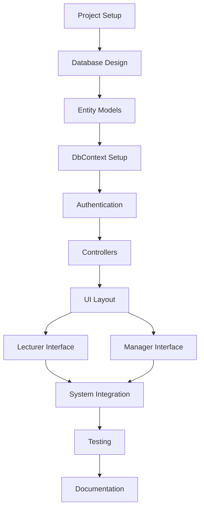

# CMCS Project Plan - Part 1: Prototype Development

## Project Overview
**Project Name**: Contract Monthly Claim System (CMCS)  
**Duration**: 4-6 weeks  
**Phase**: Part 1 - Project Planning and Prototype Development  
**Technology Stack**: ASP.NET Core MVC, Entity Framework Core, SQL Server

## Project Timeline

### Week 1: Project Setup and Planning
**Duration**: 5 days  
**Dependencies**: None

#### Tasks:
1. **Project Initialization** (Day 1)
   - Create ASP.NET Core MVC project
   - Set up Entity Framework Core
   - Configure SQL Server connection
   - Initialize Git repository

2. **Database Design** (Day 2-3)
   - Design UML class diagram
   - Create entity models (User, Lecturer, Claim, ClaimApproval, Document)
   - Set up DbContext
   - Create initial migration

3. **Documentation** (Day 4-5)
   - Write design documentation
   - Document assumptions and constraints
   - Create project plan
   - Document GUI design choices

### Week 2: Core Infrastructure
**Duration**: 5 days  
**Dependencies**: Week 1 completion

#### Tasks:
1. **Authentication Setup** (Day 1-2)
   - Implement basic authentication
   - Create user roles (Lecturer, Academic Manager, HR, Programme Coordinator)
   - Set up authorization policies

2. **Database Implementation** (Day 3)
   - Run migrations
   - Seed initial data
   - Test database operations

3. **Basic Controllers** (Day 4-5)
   - Create HomeController
   - Create AccountController
   - Implement basic routing

### Week 3: User Interface Development
**Duration**: 5 days  
**Dependencies**: Week 2 completion

#### Tasks:
1. **Layout and Navigation** (Day 1-2)
   - Create master layout
   - Implement responsive navigation
   - Set up Bootstrap styling

2. **Lecturer Interface** (Day 3)
   - Create claim submission form
   - Implement document upload
   - Create claim history view

3. **Manager Interface** (Day 4-5)
   - Create dashboard for managers
   - Implement claim approval interface
   - Create reporting views

### Week 4: Integration and Testing
**Duration**: 5 days  
**Dependencies**: Week 3 completion

#### Tasks:
1. **System Integration** (Day 1-2)
   - Connect all components
   - Test user workflows
   - Implement error handling

2. **Testing and Debugging** (Day 3-4)
   - Unit testing
   - Integration testing
   - User acceptance testing

3. **Documentation and Deployment** (Day 5)
   - Finalize documentation
   - Prepare deployment package
   - Create user manual

## Task Dependencies

## Resource Requirements

### Human Resources
- **Developer**: 1 full-time developer
- **Project Manager**: 0.5 FTE for oversight
- **QA Tester**: 0.25 FTE for testing phase

### Technical Resources
- **Development Environment**: Visual Studio 2022
- **Database**: SQL Server (LocalDB for development)
- **Version Control**: Git repository
- **Hosting**: Local development server

## Risk Assessment

### High Risk
1. **Database Migration Issues**
   - **Mitigation**: Thorough testing of migrations, backup strategies
   - **Contingency**: Manual database setup if migrations fail

2. **Authentication Complexity**
   - **Mitigation**: Use built-in ASP.NET Core Identity
   - **Contingency**: Implement basic custom authentication

### Medium Risk
1. **UI/UX Design Challenges**
   - **Mitigation**: Use Bootstrap framework, follow design patterns
   - **Contingency**: Simplify interface if time constraints arise

2. **File Upload Security**
   - **Mitigation**: Implement file type validation and size limits
   - **Contingency**: Use cloud storage service if local storage fails

### Low Risk
1. **Performance Issues**
   - **Mitigation**: Optimize database queries, implement caching
   - **Contingency**: Scale hardware resources

## Success Criteria

### Functional Requirements
- [ ] User authentication and authorization working
- [ ] Claim submission and approval workflow functional
- [ ] Document upload and storage working
- [ ] Dashboard displaying key metrics
- [ ] Responsive design across devices

### Non-Functional Requirements
- [ ] Application loads within 3 seconds
- [ ] Supports concurrent users (minimum 10)
- [ ] Data integrity maintained
- [ ] Basic security measures implemented
- [ ] Code follows best practices

## Deliverables

### Week 1 Deliverables
- [ ] UML Class Diagram
- [ ] Design Documentation
- [ ] Project Plan
- [ ] Basic project structure

### Week 2 Deliverables
- [ ] Working authentication system
- [ ] Database with sample data
- [ ] Basic controllers and routing

### Week 3 Deliverables
- [ ] Complete user interface
- [ ] Lecturer claim submission functionality
- [ ] Manager approval interface

### Week 4 Deliverables
- [ ] Fully integrated system
- [ ] Test results and bug fixes
- [ ] User documentation
- [ ] Deployment package

## Quality Assurance

### Code Quality
- Code reviews for all major components
- Unit tests for business logic
- Integration tests for database operations
- Performance testing for critical paths

### Documentation Quality
- Technical documentation for all components
- User manual for end users
- API documentation for future enhancements
- Deployment guide for production setup

## Change Management

### Scope Changes
- All scope changes must be approved by project stakeholders
- Impact assessment required for timeline and resource adjustments
- Documentation updates required for approved changes

### Version Control
- All code changes tracked in Git
- Feature branches for major development
- Tagged releases for major milestones
- Backup strategy for database and files

## Communication Plan

### Daily Standups
- Progress updates
- Blockers and impediments
- Next day priorities

### Weekly Reviews
- Milestone progress
- Risk assessment updates
- Resource allocation review

### Stakeholder Updates
- Weekly progress reports
- Demo sessions for completed features
- Final presentation of prototype
